# 📊 Nexora — Flowcharts, APIs & Problem-Solution Analysis

---

## Table of Contents

1. [Problems This Website Solves](#1-problems-this-website-solves)
2. [All APIs Used](#2-all-apis-used)
3. [System Flowcharts](#3-system-flowcharts)

---

## 1. Problems This Website Solves

### Problem → Solution Matrix

| # | Problem in Schools Today | How Nexora Solves It |
|---|---|---|
| 1 | **Students are bored in class** — Traditional lectures don't engage Gen-Z learners | Gamified quizzes with points, streaks, and ELO rankings make learning feel like a game |
| 2 | **No way to practice coding** — Students must install compilers locally, which is complex and error-prone | Built-in online code compiler (Judge0) supports 40+ languages, runs in the browser |
| 3 | **Cheating on exams is easy** — Paper-based or basic online quizzes are easy to cheat on | Anti-cheat: tab-switch detection, timed questions, shuffled answer choices |
| 4 | **Teachers can't track student performance** — Manual grading and no analytics | Automated scoring, quiz history, player stats, and teacher dashboard with analytics |
| 5 | **No competitive learning** — Students have no motivation to improve beyond passing grades | PvP code battles, tournaments with brackets, ELO rating system, leaderboards |
| 6 | **Communication is scattered** — Students use Messenger, email, Viber for school-related talk | Built-in messaging (DM + group), section chat, tournament chat — all in one platform |
| 7 | **No coding competitions** — Schools want coding contests but lack the infrastructure | Tournament system with seeded brackets, spectator mode, and automated judging |
| 8 | **Creating quiz content takes hours** — Teachers manually write every question | AI Quiz Generator (Google Gemini AI) creates questions instantly on any topic |
| 9 | **Students don't practice consistently** — No habit-building mechanism | Daily challenges with streak tracking — miss a day, lose your streak |
| 10 | **Lost items on campus** — No centralized reporting system | Built-in Lost & Found board with categories, images, and status tracking |
| 11 | **Students study alone** — No way to find study partners with similar interests | Study Buddy pairing system — match by interests, send requests |
| 12 | **Grade computation is confusing** — Students don't know how to compute weighted grades | Grade Calculator with OCR — even upload photos of paper grade sheets |
| 13 | **No school community platform** — Students lack a safe, school-specific social space | Social feed (posts, likes, comments) and blog for teacher announcements |
| 14 | **I.T. students don't build real projects** — Curriculum lacks practical application | Nexora itself IS the capstone project — built by the I.T. department |
| 15 | **Typing speed is undervalued** — An essential skill for I.T. students with no training tool | Typing contest with WPM, accuracy tracking, and leaderboard |

### Impact Summary

```
┌──────────────────────────────────────────────────────────┐
│              BEFORE Nexora                            │
│                                                          │
│  📋 Paper quizzes          → Easy to cheat               │
│  📧 Fragmented comms       → Missed announcements        │
│  💻 No coding environment  → Students can't practice     │
│  📊 Manual grading         → Teacher burnout              │
│  😴 Boring classes         → Low engagement               │
│  🏆 No competitions        → No motivation                │
└──────────────────────────────────────────────────────────┘
                         ▼ ▼ ▼
┌──────────────────────────────────────────────────────────┐
│              AFTER Nexora                             │
│                                                          │
│  🎮 Gamified quizzes       → 10x engagement              │
│  💬 Unified messaging      → Nothing gets missed          │
│  ⚡ Online compiler        → Practice anytime             │
│  🤖 AI + auto-grading      → Teacher time saved           │
│  🔥 Streaks & rankings     → Students come back daily     │
│  🏆 Tournaments            → School-wide coding events    │
└──────────────────────────────────────────────────────────┘
```

---

## 2. All APIs Used

### A. External APIs (Third-Party Services)

These are APIs from outside services that Nexora connects to:

| # | API | Provider | Purpose | How It's Used |
|---|---|---|---|---|
| 1 | **Judge0 CE API** | Self-hosted (Docker) | Code compilation & execution | Runs student code in 40+ languages inside sandboxed Docker containers. Receives source code → returns output, errors, execution time, memory usage |
| 2 | **Google Gemini AI API** | Google DeepMind | AI quiz generation & code explanations | Generates quiz questions on any topic. Also provides AI-powered explanations for code challenges and wrong answers |
| 3 | **OpenAI GPT API** | OpenAI | Fallback AI provider | Used when Gemini is unavailable. Same functions: quiz generation and code explanations |
| 4 | **SimpleJWT** | Django library | JWT token authentication | Issues access tokens (12h) and refresh tokens (7d) for stateless authentication |

### B. Internal REST API Endpoints (Built by Us)

> **Base URL:** `http://localhost:8000/api/`

---

#### 🔐 Authentication & Accounts — `/api/auth/`

| Method | Endpoint | Purpose |
|---|---|---|
| `POST` | `/api/auth/register/` | Register a new student/teacher account |
| `POST` | `/api/auth/login/` | Login and receive JWT tokens |
| `POST` | `/api/auth/token/refresh/` | Refresh an expired access token |
| `GET/PUT` | `/api/auth/me/` | Get or update current user profile |
| `POST` | `/api/auth/change-password/` | Change account password |
| `DELETE` | `/api/auth/delete-account/` | Permanently delete account |
| `GET` | `/api/auth/search/` | Search for users by name/username |
| `GET` | `/api/auth/students/` | List all students (teacher only) |
| `GET` | `/api/auth/students/<id>/` | View specific student details |

---

#### 📝 Quiz System — `/api/quiz/`

| Method | Endpoint | Purpose |
|---|---|---|
| `GET` | `/api/quiz/subjects/` | List all quiz subjects |
| `POST` | `/api/quiz/start/` | Start a new quiz session |
| `POST` | `/api/quiz/answer/` | Submit an answer to a question |
| `POST` | `/api/quiz/<id>/complete/` | Complete and score a quiz session |
| `POST` | `/api/quiz/<id>/tab-switch/` | Report a tab switch (anti-cheat) |
| `GET` | `/api/quiz/history/` | View past quiz sessions |
| `GET` | `/api/quiz/session/<id>/` | View specific session details |
| `POST` | `/api/quiz/ai-generate/` | Generate questions using AI |

---

#### 💻 Code Compiler — `/api/compiler/`

| Method | Endpoint | Purpose |
|---|---|---|
| `GET` | `/api/compiler/languages/` | List supported programming languages |
| `POST` | `/api/compiler/run/` | Submit code for execution via Judge0 |
| `GET` | `/api/compiler/submission/<id>/` | View a specific submission result |
| `GET` | `/api/compiler/history/` | View past code submissions |

---

#### ⚔️ Code Battle — `/api/compiler/`

| Method | Endpoint | Purpose |
|---|---|---|
| `GET` | `/api/compiler/challenges/` | List all coding challenges |
| `GET` | `/api/compiler/challenges/<slug>/` | View challenge details + test cases |
| `POST` | `/api/compiler/battle/start/` | Start a battle session on a challenge |
| `POST` | `/api/compiler/battle/<id>/submit/` | Submit solution for judge evaluation |
| `GET` | `/api/compiler/battle/<id>/result/` | View battle session results |
| `GET` | `/api/compiler/battle/history/` | View past battle sessions |
| `POST` | `/api/compiler/community-challenges/` | Create a community challenge |

---

#### 🏆 PvP Battles & Invites

| Method | Endpoint | Purpose |
|---|---|---|
| `GET` | `/api/compiler/pvp/<id>/replay/` | View PvP battle replay data |
| `POST` | `/api/compiler/invites/send/` | Send a battle invite to a friend |
| `POST` | `/api/compiler/invites/<id>/respond/` | Accept or decline a battle invite |
| `GET` | `/api/compiler/invites/pending/` | List pending battle invites |

---

#### 📅 Daily Challenges — `/api/compiler/`

| Method | Endpoint | Purpose |
|---|---|---|
| `GET` | `/api/compiler/daily/` | Get today's coding challenge |
| `POST` | `/api/compiler/daily/submit/` | Submit solution for today's challenge |
| `GET` | `/api/compiler/daily/leaderboard/` | View daily challenge leaderboard |
| `GET` | `/api/compiler/daily/streak/` | Get current daily streak stats |

---

#### 🎯 Tournaments — `/api/compiler/`

| Method | Endpoint | Purpose |
|---|---|---|
| `GET/POST` | `/api/compiler/tournaments/` | List or create tournaments |
| `POST` | `/api/compiler/tournaments/join/` | Join tournament by invite code |
| `GET` | `/api/compiler/tournaments/<id>/` | View tournament bracket and details |
| `POST` | `/api/compiler/tournaments/<id>/join/` | Join tournament by ID |
| `POST` | `/api/compiler/tournaments/<id>/start/` | Start the tournament (host only) |
| `POST` | `/api/compiler/tournaments/<id>/submit/` | Submit code for a tournament match |
| `DELETE` | `/api/compiler/tournaments/<id>/delete/` | Delete a tournament |
| `POST` | `/api/compiler/tournaments/<id>/leave/` | Leave a tournament |
| `GET` | `/api/compiler/tournaments/<id>/check-timeout/` | Check if match has timed out |

---

#### 🏫 Classroom — `/api/classroom/`

| Method | Endpoint | Purpose |
|---|---|---|
| `GET/POST` | `/api/classroom/sections/` | List or create sections |
| `POST` | `/api/classroom/sections/join/` | Join section with code |
| `GET` | `/api/classroom/sections/<id>/` | View section details |
| `POST` | `/api/classroom/sections/<id>/leave/` | Leave a section |
| `GET` | `/api/classroom/sections/<id>/students/` | List students in section |
| `GET` | `/api/classroom/sections/<id>/assignments/` | List section assignments |
| `POST` | `/api/classroom/sections/<id>/assign/` | Create new assignment |

---

#### 📊 Leaderboard — `/api/leaderboard/`

| Method | Endpoint | Purpose |
|---|---|---|
| `GET` | `/api/leaderboard/` | Global leaderboard (rank points + ELO) |
| `GET` | `/api/leaderboard/me/` | Current user's stats |

---

#### ⌨️ Typing Contest — `/api/typing/`

| Method | Endpoint | Purpose |
|---|---|---|
| `GET` | `/api/typing/texts/` | List available typing texts |
| `GET` | `/api/typing/random/` | Get a random typing text |
| `POST` | `/api/typing/submit/` | Submit typing result (WPM, accuracy) |
| `GET` | `/api/typing/leaderboard/` | Typing speed leaderboard |
| `GET` | `/api/typing/history/` | Past typing results |

---

#### 📱 Social Feed — `/api/social/`

| Method | Endpoint | Purpose |
|---|---|---|
| `GET` | `/api/social/feed/` | View social feed posts |
| `POST` | `/api/social/posts/` | Create a new post |
| `DELETE` | `/api/social/posts/<id>/delete/` | Delete a post |
| `POST` | `/api/social/posts/<id>/like/` | Like/unlike a post |
| `POST` | `/api/social/posts/<id>/comment/` | Add a comment |
| `GET` | `/api/social/my-posts/` | View own posts |

---

#### 📰 Blog — `/api/blog/`

| Method | Endpoint | Purpose |
|---|---|---|
| `GET` | `/api/blog/` | List all blog/announcement posts |
| `GET` | `/api/blog/<id>/` | View a specific blog post |
| `POST` | `/api/blog/create/` | Create blog post (teacher only) |
| `PUT` | `/api/blog/<id>/update/` | Update blog post |
| `DELETE` | `/api/blog/<id>/delete/` | Delete blog post |

---

#### 💬 Messaging — `/api/messaging/`

| Method | Endpoint | Purpose |
|---|---|---|
| `GET` | `/api/messaging/` | List conversations |
| `POST` | `/api/messaging/create/` | Create a new conversation |
| `GET` | `/api/messaging/<id>/messages/` | Get messages in a conversation |
| `POST` | `/api/messaging/<id>/send/` | Send a message |
| `GET` | `/api/messaging/search-users/` | Search users to message |

---

#### 📦 Lost & Found — `/api/lostandfound/`

| Method | Endpoint | Purpose |
|---|---|---|
| `GET` | `/api/lostandfound/` | List all lost/found items |
| `POST` | `/api/lostandfound/create/` | Report a lost/found item |
| `PATCH` | `/api/lostandfound/<id>/status/` | Update item status |
| `DELETE` | `/api/lostandfound/<id>/delete/` | Delete a listing |
| `GET` | `/api/lostandfound/my-items/` | View own listings |

---

#### 🤝 Study Buddy Pairing — `/api/pairing/`

| Method | Endpoint | Purpose |
|---|---|---|
| `GET` | `/api/pairing/available/` | List students available for pairing |
| `POST` | `/api/pairing/request/` | Send a pairing request |
| `GET` | `/api/pairing/my-requests/` | View sent/received requests |
| `POST` | `/api/pairing/<id>/respond/` | Accept or decline a request |

---

#### 👤 Profile & Friends — `/api/compiler/`

| Method | Endpoint | Purpose |
|---|---|---|
| `GET` | `/api/compiler/profile/stats/` | Get detailed profile statistics |
| `GET` | `/api/compiler/friends/search/` | Search users to follow |
| `POST` | `/api/compiler/friends/follow/<id>/` | Follow/unfollow a user |
| `GET` | `/api/compiler/friends/` | List followed users |

---

#### 🔔 Notifications — `/api/compiler/`

| Method | Endpoint | Purpose |
|---|---|---|
| `GET` | `/api/compiler/notifications/` | List all notifications |
| `POST` | `/api/compiler/notifications/read/` | Mark notifications as read |
| `GET` | `/api/compiler/notifications/unread-count/` | Get unread notification count |

---

#### 🤖 AI Features — `/api/compiler/`

| Method | Endpoint | Purpose |
|---|---|---|
| `POST` | `/api/compiler/ai/explain/` | Get AI explanation for code/problem |

---

#### 🏰 Tower Defense — `/api/compiler/`

| Method | Endpoint | Purpose |
|---|---|---|
| `POST` | `/api/compiler/tower-defense/submit/` | Submit tower defense game score |
| `GET` | `/api/compiler/tower-defense/leaderboard/` | Tower defense leaderboard |

---

### C. WebSocket Endpoints (Real-Time)

> **Base URL:** `ws://localhost:8000/`

| Endpoint | Consumer | Purpose |
|---|---|---|
| `ws/battle/` | `BattleConsumer` | Real-time PvP code battle (matchmaking, countdown, code sync, results) |
| `ws/notifications/` | `NotificationConsumer` | Push notifications (invites, challenge results, announcements) |
| `ws/spectate/<tournament_id>/` | `SpectatorConsumer` | Live spectating of tournament matches |
| `ws/tournament-chat/<tournament_id>/` | `TournamentChatConsumer` | Chat room within a tournament |
| `ws/section-chat/<section_id>/` | `SectionChatConsumer` | Classroom section group chat |

---

### API Count Summary

| Category | Count |
|---|---|
| REST API Endpoints | **83** |
| WebSocket Endpoints | **5** |
| External APIs | **3** (Judge0, Gemini, OpenAI) |
| **Total** | **91 endpoints** |

---

## 3. System Flowcharts

### 3.1 Overall System Architecture

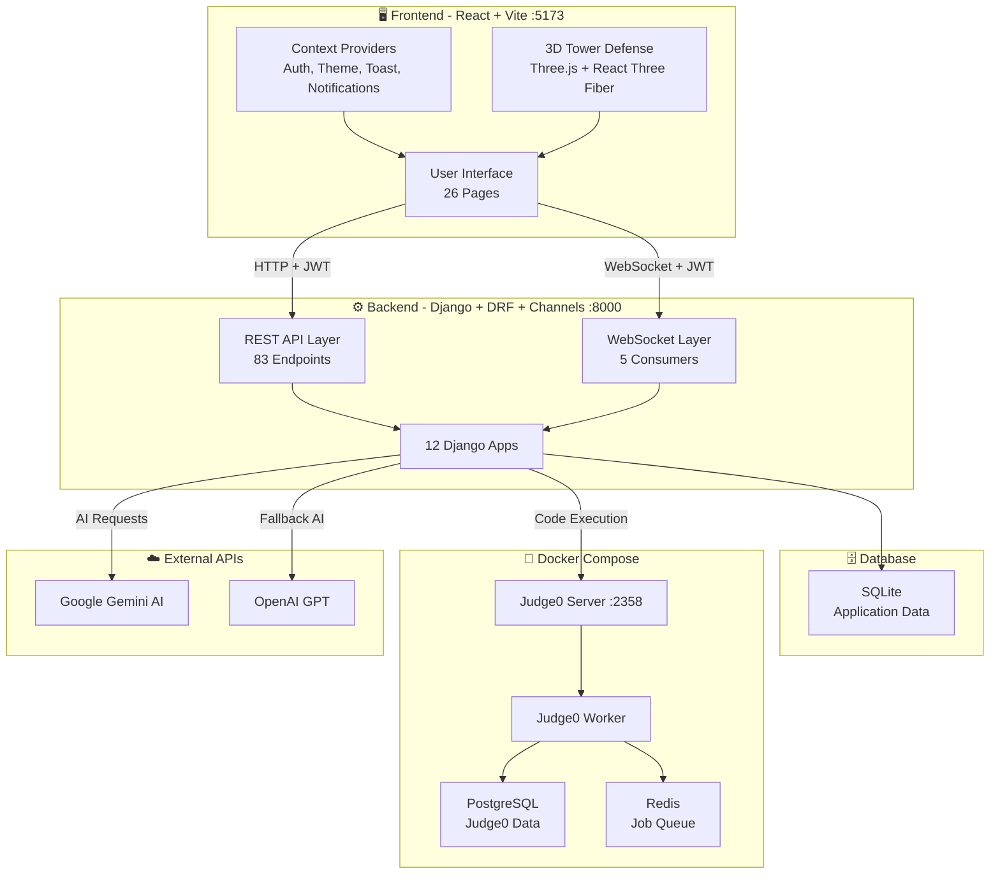

---

### 3.2 User Authentication Flow

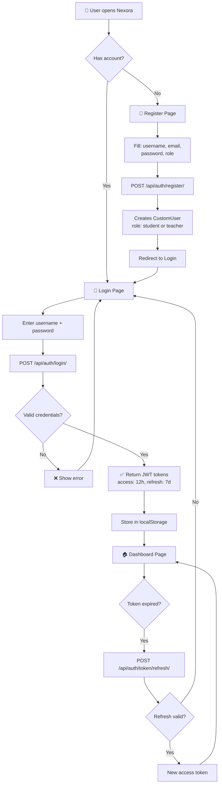

---

### 3.3 Quiz System Flow

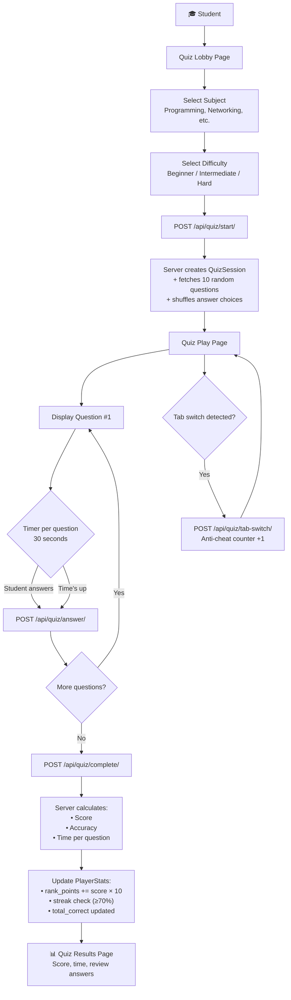

---

### 3.4 Code Compiler Flow

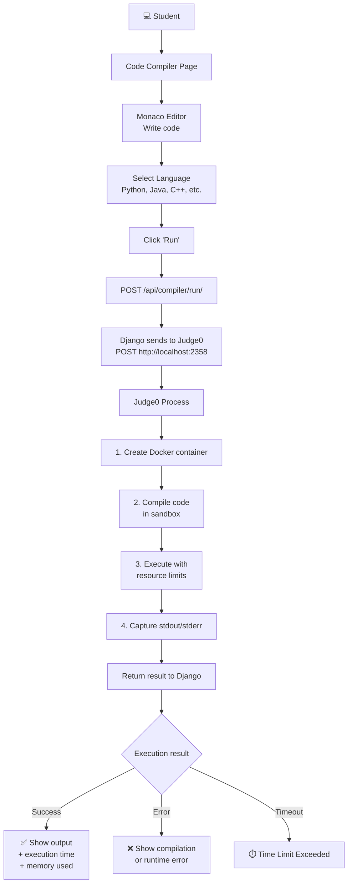

---

### 3.5 PvP Code Battle Flow

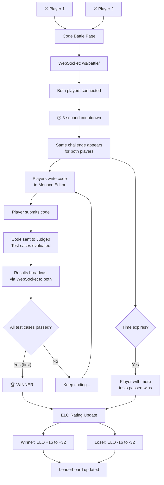

---

### 3.6 Tournament Flow

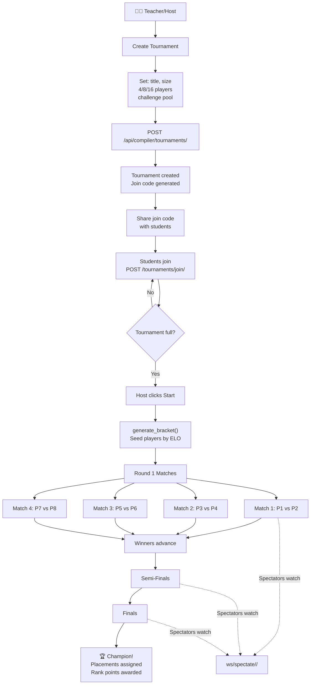

---

### 3.7 Classroom & Section Flow

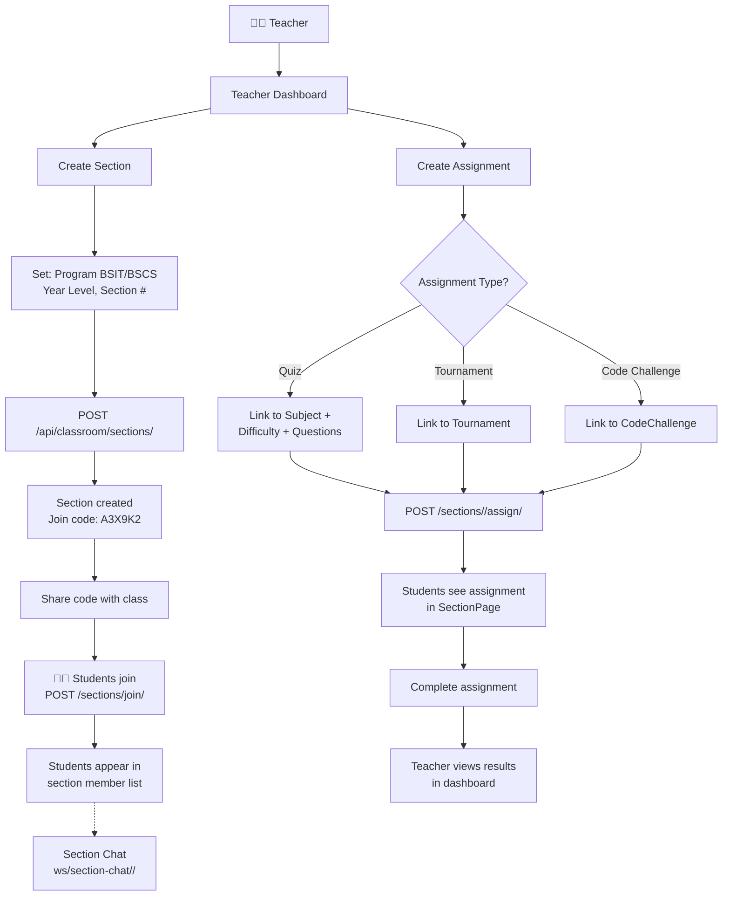

---

### 3.8 Daily Challenge Flow

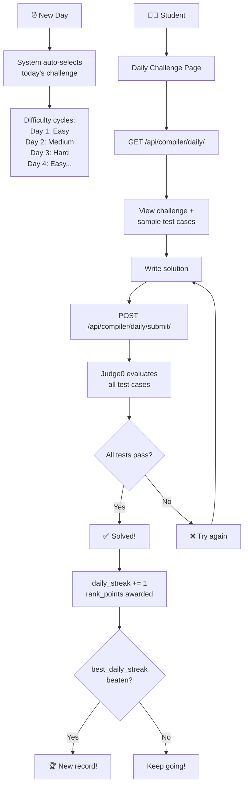

---

### 3.9 Study Buddy Pairing Flow

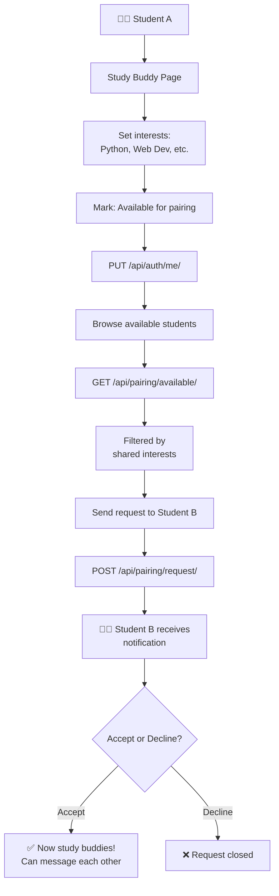

---

### 3.10 Social & Communication Flow

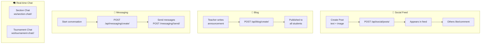

---

### 3.11 Complete User Journey

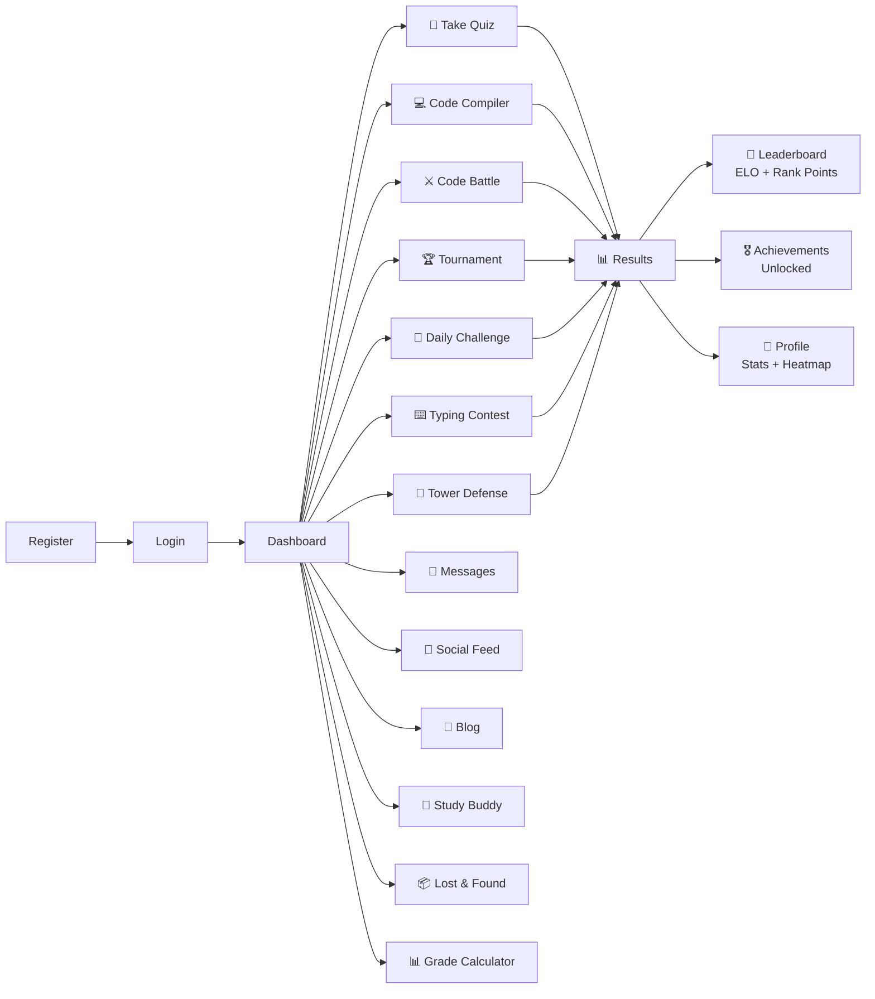

---

### 3.12 Data Flow Overview

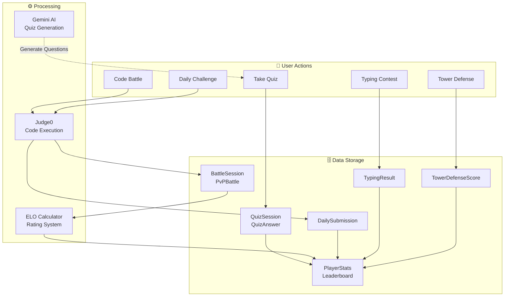

---

### 3.13 Notification System Flow

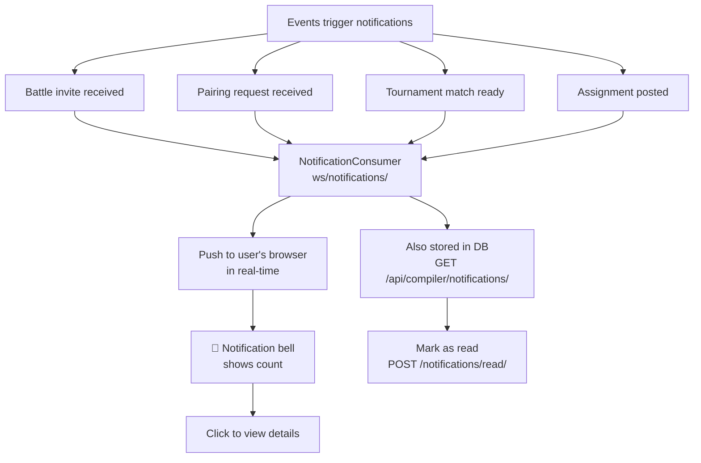

---

### 3.14 ELO Rating System Flow

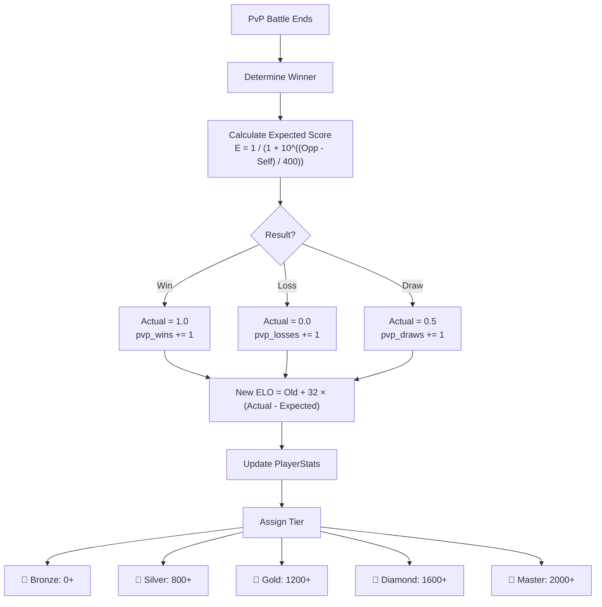

---

*This document contains all flowcharts, API documentation, and problem-solution analysis for the Nexora system.*

*Last updated: February 15, 2026*
